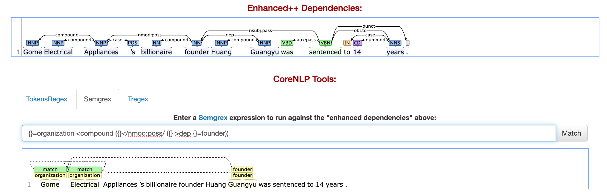

```{r setup, include=FALSE}
knitr::opts_chunk$set(echo = TRUE, fig.pos = 'H')
```

## Problem 1
Located in the notebook file.

## Problem 2
### Problem 2.1
What is the CQL query for modifiers of Covid (all forms)?

```cql
[word="(?i)covid(-|\s)?(\d+)?"]
```

Include the snapshot of the 20 most frequent forms of Covid:


\newpage

### Problem 2.2

What is the CQL query for modifiers of covid (all forms)?

```cql
[tag="JJ"] [word="(?i)covid(-|\s)?(\d+)?"]
```

Include the snapshot of the 20 most frequent modifiers modifiers:


\newpage

What is the CQL query of words that are modified by Covid (all forms)?

```cql
[word="(?i)covid(-|\s)?(\d+)?"] [tag="N.*"]
```

Include the snapshot of those words:


\newpage

What is the CQL query for words that occur in right coordination with Covid (all forms) (e.g., in Covid-19 , SARS-2002 , and HCoV-NL63, the words iSARS-2002 and HCoV-NL63 are the right conjuncts/coordinates).

```cql
[tag="N.*" & (word !="(?i)covid(-|\s)?(\d+)?('s)?")] within 
[word="(?i)covid(-|\s)?(\d+)?"] ([tag="CC" | word=","][(tag="N.*")]){0,9999}
```

Include the snapshot of those words:


\newpage

What is the CQL query for verbs that can take Covid (all forms) as subject?

```cql
[word="(?i)covid(-|\s)?(\d+)?"][]{0,2}[(tag != "VH.* | VB.*") & (tag = "VV.*")]
```

Include the snapshot of verbs that take Covid as subject:


\newpage

What is the CQL query for verbs that can take Covid (all forms) as object?

```cql
[(tag ="V.*")&(tag!="VB.*|VH.*")][]{0,2}[word="(?i)covid(-|\s)?(\d+)?"]
```

Include the snapshot of verbs that take Covid as object:


### Problem 2.3

For this corpus, the LogDice score appears to be the most effective metric for identifying and ranking collocations
The ranking from Mutual Information (MI) score is unique but prioritizes rare word combinations ($\le 10$ co-occurrences). This characteristic of MI can lead to highlighting less frequent, therefore potentially less relevant collocations in the context of a prevalent and significant term like "COVID."

The T-Score, places emphasis on more common words such as "of" In this specific corpus, these common words provide relatively minimal informational value about the unique linguistic patterns associated with COVID-19.

The LogDice score offers a more balanced result. It appear to effectively normalize the frequency of word pairs and addresses the biases towards extremely rare or extremely common words. This produced good results, where overly common words and overly scarse words are ranked lower. Among all three rankings, the LogDice score gives more nuanced and contextually relevant ranking of collocations that balances statically significance and content richness well.

\newpage

## Problem 3


### Problem 3.1

__De La Salle High School__ was founded by the Christian Brothers .

Semgrex:
```semgrex
{}=organization </nsubj:pass/ ({} >/obl:by/ {}=founder | >/obl:agent/ {}=founder)
```

Result:


\newpage

__Metalucifer__ is a Japanese heavy metal band founded by __Gezolucifer__ in 1995 .

__YTL Corporation__ is a Malaysian infrastructure conglomerate founded in 1955 by __Tan Sri Dato__.

__NetObjects Inc.__ is a software company founded in 1995 by __Samir Arora, David Kleinberg Clement Mok__ and __Sal Arora__.

Semgrex:
```semgrex
{}=organization <nsubj ({} >acl ({} >/obl:by/ {}=founder | >/obl:agent/ {}=founder))
```

Result:


\newpage

__Gome__ has made its founder __Huang Guangyu__ one of China's richest entrepreneurs.


Semgrex:
```semgrex
{}=organization <nsubj ({} >iobj ({lemma:founder} >dep {tag:NNP}=founder))
```

Result:


\newpage

Verbitsky became a close associate of __Eduard Limonov__'s __National Bolshevik Party__.

Semgrex:
```semgrex
{} = organization >/nmod:poss/ {} = founder
```

Result:


\newpage

__Gome Electrical Appliances__’s billionaire founder __Huang Guangyu__ was sentenced to 14 years.

Semgrex:
```semgrex
{}=organization <compound ({}</nmod:poss/ ({} >dep {}=founder))
```

Result: 


